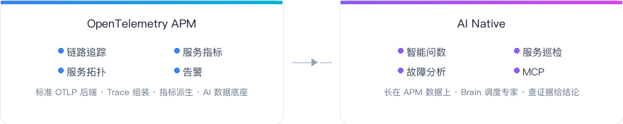

<div align="center">

<p align="center">
  
  &nbsp;&nbsp;
  
</p>

<h3>国产开源 · AI Native OpenTelemetry APM</h3>

<p align="center">
  <a href="README_en.md">English</a>
  &nbsp;|&nbsp;
  <a href="#交流群">交流群</a>
</p>

</div>

<br/>

<p align="center">
  
</p>

<br/>

---

<h2 align="center" id="效果展示">效果展示</h2>

<p align="center"><strong>AI 分析</strong></p>

<table border="0" cellspacing="12" cellpadding="0" align="center">
<tr>
<td align="center" width="450">
  
  <br/><sub>智能问数 · 自然语言查指标与 Trace</sub>
</td>
<td align="center" width="450">
  
  <br/><sub>多 Agent 协同 · 汇总证据给出结论</sub>
</td>
</tr>
</table>

<p align="center"><strong>APM 可观测</strong></p>

<table border="0" cellspacing="12" cellpadding="0" align="center">
<tr>
<td align="center" width="450">
  
  <br/><sub>服务列表 · 红绿灯锁定异常</sub>
</td>
<td align="center" width="450">
  
  <br/><sub>全局拓扑 · 自动绘制调用关系</sub>
</td>
</tr>
<tr>
<td align="center" width="450">
  
  <br/><sub>服务详情 · 指标趋势与实例</sub>
</td>
<td align="center" width="450">
  
  <br/><sub>服务流 · 上下游依赖</sub>
</td>
</tr>
</table>

---

<h2 align="center">极简架构</h2>

<p align="center">
  
</p>

---

<h2 align="center" id="安装">快速安装</h2>

> ⚡ 从执行安装命令到 Demo 应用上报数据、看到链路追踪与拓扑，约 **5 分钟** 即可出效果。

<p align="center">
  
</p>

依赖 **docker**、**docker-compose**；安装脚本自动识别 amd64/arm64，下载对应镜像包。

**1. 安装平台**

```bash
curl -fsSL https://databuff.ai/databuff/ai-apm-install.sh | bash
```

**2. 安装 Demo 应用**（可选）

```bash
curl -fsSL https://databuff.ai/databuff/ai-apm-demo-install.sh | bash
```

<details>
<summary><b>Kubernetes 安装</b></summary>

依赖 **kubectl** 与可用 K8s 集群；脚本通过 K8s manifest 直装平台。

**1. 安装平台**

```bash
curl -fsSL https://databuff.ai/databuff/ai-apm-k8s-install.sh | bash
```

**2. 安装 Demo 应用**（可选）

```bash
curl -fsSL https://databuff.ai/databuff/ai-apm-demo-k8s-install.sh | bash
```

**离线镜像下载**

若上方安装命令因网络问题无法拉取镜像，可执行以下命令下载离线镜像包，并自动 load 到节点。

```bash
curl -fsSL https://databuff.ai/databuff/ai-apm-k8s-download-images.sh | bash
```

</details>

<p align="center">
  访问 <code>http://YOUR_HOST:27403</code> · 模型配置填入 API Key 启用 AI
  <br/>
</p>

---

<h2 align="center" id="交流群">交流群</h2>

<p align="center">
  微信扫码加入 <strong>Databuff 开源交流群</strong>
  <br/><br/>
  
</p>

<br/>
