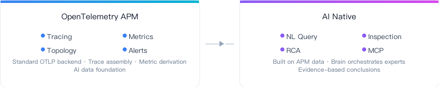
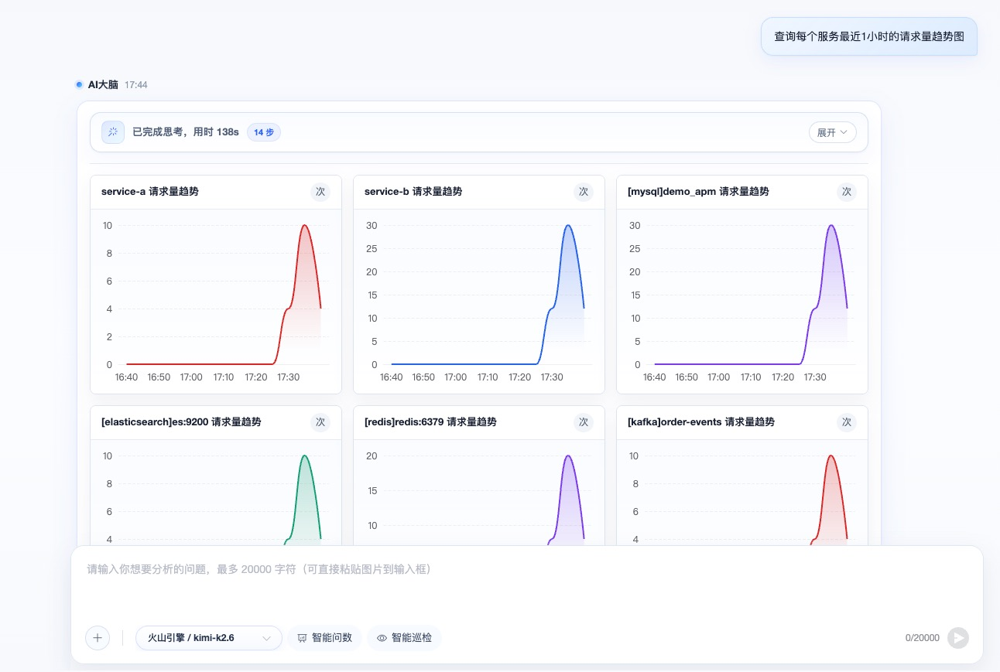
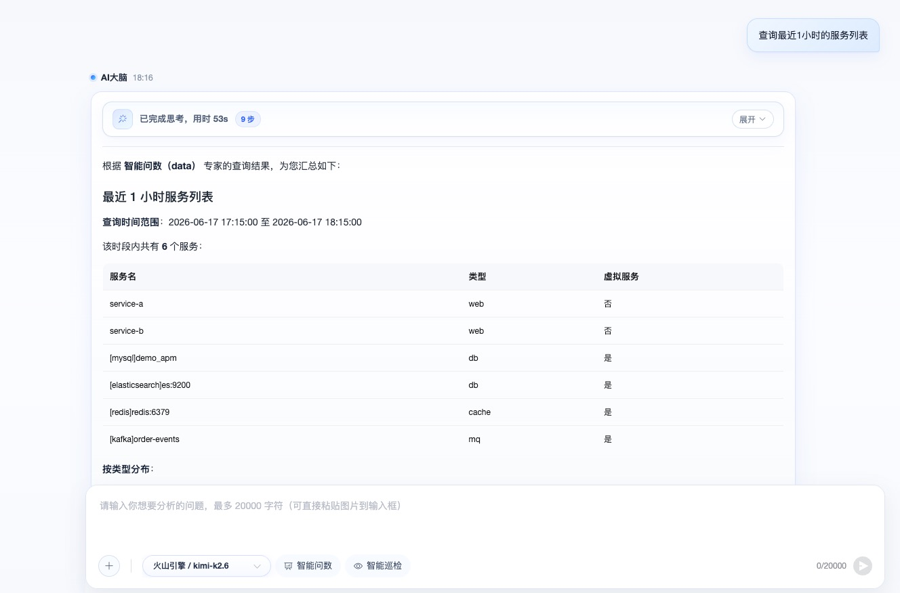
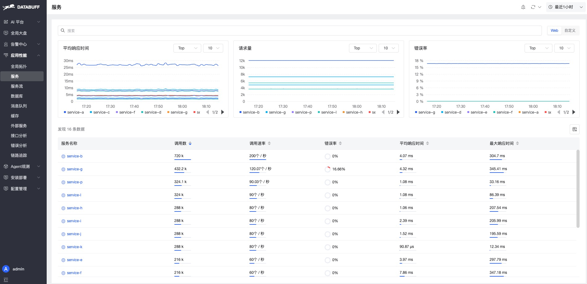
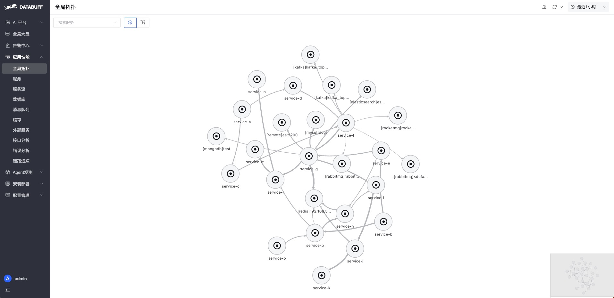
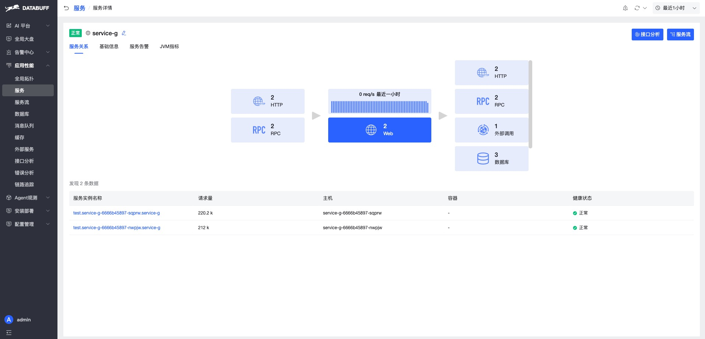
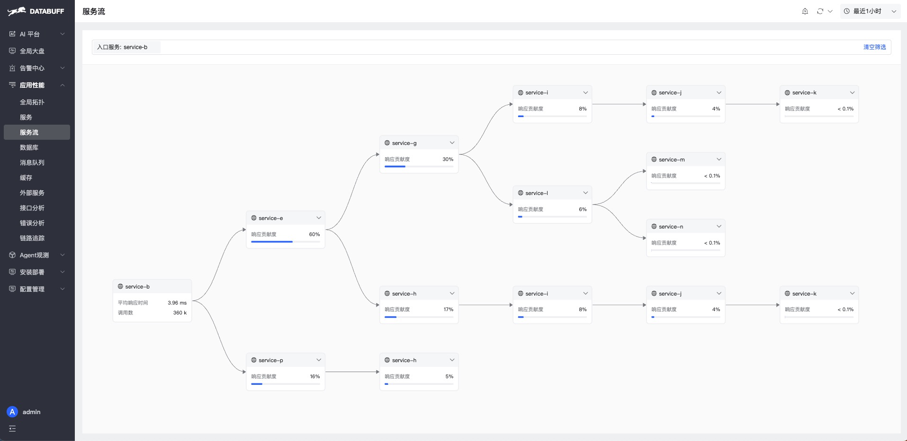
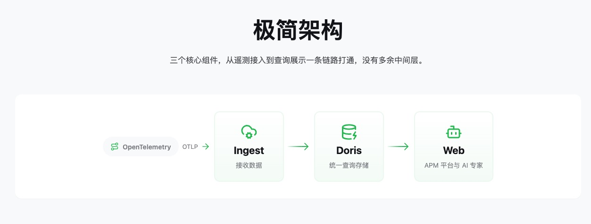

<div align="center">

<p align="center">
  
  &nbsp;&nbsp;
  
</p>

<h3>Open Source · AI Native OpenTelemetry APM</h3>

<p align="center">
  <a href="README.md">中文</a>
  &nbsp;|&nbsp;
  <a href="#community">Community</a>
</p>

</div>

<br/>

<p align="center">
  
</p>

<br/>

---

<h2 align="center" id="screenshots">Screenshots</h2>

<p align="center"><strong>AI Analysis</strong></p>

<table border="0" cellspacing="12" cellpadding="0" align="center">
<tr>
<td align="center" width="450">
  
  <br/><sub>Natural language query · Metrics and traces in plain language</sub>
</td>
<td align="center" width="450">
  
  <br/><sub>Multi-agent collaboration · Evidence synthesis and conclusions</sub>
</td>
</tr>
</table>

<p align="center"><strong>APM Observability</strong></p>

<table border="0" cellspacing="12" cellpadding="0" align="center">
<tr>
<td align="center" width="450">
  
  <br/><sub>Service list · Traffic-light status for anomalies</sub>
</td>
<td align="center" width="450">
  
  <br/><sub>Global topology · Auto-generated call graph</sub>
</td>
</tr>
<tr>
<td align="center" width="450">
  
  <br/><sub>Service detail · Metric trends and instances</sub>
</td>
<td align="center" width="450">
  
  <br/><sub>Service flow · Upstream and downstream dependencies</sub>
</td>
</tr>
</table>

---

<h2 align="center">Architecture</h2>

<p align="center">
  
</p>

---

<h2 align="center" id="installation">Quick Start</h2>

> ⚡ From running the install command to demo apps reporting data and showing traces and topology, you can see results in about **5 minutes**.

<p align="center">
  
</p>

Requires **docker** and **docker-compose**. The install script auto-detects amd64/arm64 and downloads the matching image bundle.

**1. Install Platform**

```bash
curl -fsSL https://databuff.ai/databuff/ai-apm-install.sh | bash
```

**2. Install Demo App** (optional)

```bash
curl -fsSL https://databuff.ai/databuff/ai-apm-demo-install.sh | bash
```

<details>
<summary><b>Kubernetes</b></summary>

Requires **kubectl** and a working Kubernetes cluster. The script installs the platform via K8s manifests.

**1. Install Platform**

```bash
curl -fsSL https://databuff.ai/databuff/ai-apm-k8s-install.sh | bash
```

**2. Install Demo App** (optional)

```bash
curl -fsSL https://databuff.ai/databuff/ai-apm-demo-k8s-install.sh | bash
```

**Offline image download**

If the install commands above cannot pull images due to network issues, run the following to download an offline image bundle and load it onto the node.

```bash
curl -fsSL https://databuff.ai/databuff/ai-apm-k8s-download-images.sh | bash
```

</details>

<p align="center">
  Open <code>http://YOUR_HOST:27403</code> · Add your API key in model settings to enable AI
  <br/>
</p>

---

<h2 align="center" id="community">Community</h2>

<p align="center">
  Scan the QR code to join the <strong>Databuff open-source community</strong> on WeChat
  <br/><br/>
  
</p>

<br/>
