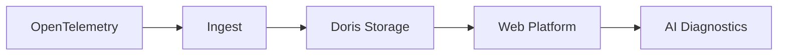

<p align="center">
  <a href="README.md">中文</a>
  &nbsp;|&nbsp;
  <a href="README_en.md">English</a>
</p>

# DataBuff Documentation

Open-source AI-native OpenTelemetry APM.

Build a standard, reliable, easy-to-deploy APM backend first, then put AI into real troubleshooting workflows.

## Quick Start

```bash
curl -fsSL https://databuff.ai/databuff/ai-apm-install.sh | bash
```

Install the platform, then install the Demo app to see traces, metrics, topology, and AI diagnostics.

## Documentation Index

### Product Overview

- [Product Overview](产品介绍_en.md)
- [Roadmap](Roadmap_en.md)

### Getting Started

- [Docker Installation](快速入门/docker安装部署_en.md)
- [Kubernetes Installation](快速入门/k8s安装部署_en.md)

### User Guide

- [AI Platform](使用手册/AI平台_en.md)
- [Custom Digital Experts](使用手册/自定义数字专家_en.md)
- [External MCP Integration](使用手册/外部MCP集成_en.md)
- [Application Performance](使用手册/应用性能_en.md)
- [Alerting](使用手册/告警_en.md)

### Architecture

- [AI Platform](架构设计/AI平台_en.md)
- [Application Performance](架构设计/应用性能_en.md)
- [Alerting](架构设计/告警_en.md)

## Core Pipeline


