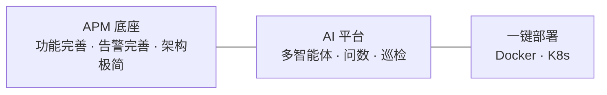
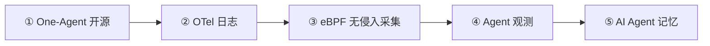
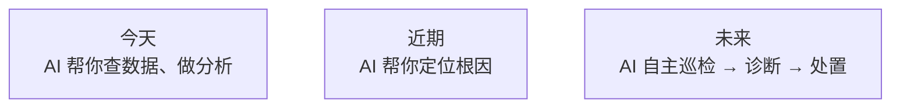

# Roadmap

## 已交付 · v0.1

**业内首个开源 AI + APM**，核心闭环已跑通。

---

## 下一阶段 · 核心规划

按优先级推进以下五项，打通「采集 → 观测 → 智能」完整链路：

| # | 方向 | 目标 |
|---|------|------|
| **①** | **One-Agent 开源** | 统一采集 Agent 开源发布，Trace / 指标 / 日志 / 主机指标一站式上报，开箱对接 DataBuff Ingest |
| **②** | **OpenTelemetry 日志** | 接入 OTLP Logs，支持 OpenTelemetry 生态的日志采集与 Trace 关联，补齐可观测性三支柱 |
| **③** | **eBPF 无侵入 APM** | 基于 eBPF 的内核级采集，零代码改动覆盖主机、容器、K8s 场景，补充 Agent 难以触达的运行时 |
| **④** | **Agent 观测** | 对 AI Agent 本身做可观测——调用链、Token 消耗、工具调用、延迟与错误，让 Agent 运行可追踪、可诊断 |
| **⑤** | **AI Agent 记忆** | 为平台内多智能体引入持久化记忆，跨会话保留上下文与诊断结论，让 AI 越用越懂你的系统 |

---

## 近期规划

| 方向 | 目标 |
|------|------|
| **AI 更深** | 流式对话、更多数字专家、因果根因分析 |
| **APM 更全** | 日志关联、RUM、更多中间件覆盖 |
| **告警更强** | 组合规则、多渠道通知、On-call 排班 |
| **部署更稳** | 多节点集群、持久化方案、Helm Chart |

---

## 长期愿景

**从「AI 辅助看」到「AI 自主管」** —— 这是 DataBuff 的终极方向。
