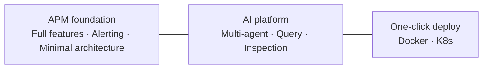
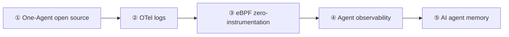
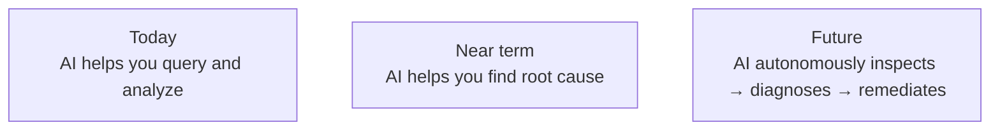

  <a href="Roadmap.md">中文</a>
  &nbsp;|&nbsp;
  <a href="Roadmap_en.md">English</a>

# Roadmap

## Delivered · v0.1

**Open-source AI-native OpenTelemetry APM** — the core loop is working end to end.

---

## Next Phase · Core Plans

Five priorities to complete the full **collect → observe → intelligently act** pipeline:

| # | Direction | Goal |
|---|-----------|------|
| **①** | **One-Agent open source** | Release a unified collection agent for traces, metrics, logs, and host metrics — ready to connect to DataBuff Ingest out of the box |
| **②** | **OpenTelemetry logs** | Ingest OTLP Logs, support OpenTelemetry log collection and trace correlation, completing the three pillars of observability |
| **③** | **eBPF zero-instrumentation APM** | Kernel-level collection via eBPF with zero code changes for host, container, and K8s scenarios — covering runtime areas agents cannot reach |
| **④** | **Agent observability** | Observe AI agents themselves — call chains, token usage, tool calls, latency, and errors — so agent runs are traceable and diagnosable |
| **⑤** | **AI agent memory** | Persistent memory for in-platform multi-agents — retain context and diagnostic conclusions across sessions so AI learns your system over time |

---

## Near-term Plans

| Direction | Goal |
|-----------|------|
| **Deeper AI** | Streaming chat, more digital experts, causal root-cause analysis |
| **Richer APM** | Log correlation, RUM, broader middleware coverage |
| **Stronger alerting** | Composite rules, incident workflows, notification integrations |
| **More stable deployment** | Multi-node clusters, persistence options, Helm Chart |

---

## Long-term Vision

**From "AI-assisted viewing" to "AI-autonomous management"** — that is DataBuff's ultimate direction.
