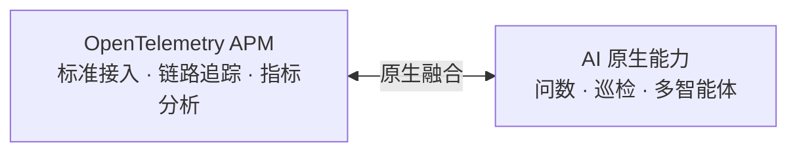
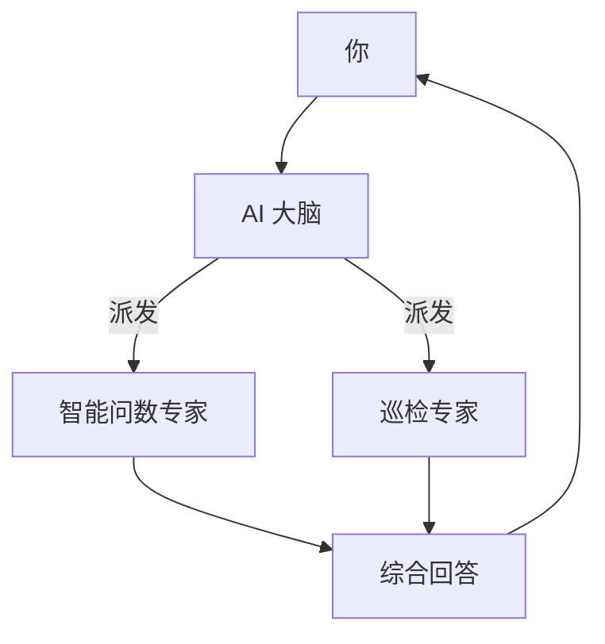

  <a href="产品介绍.md">中文</a>
  &nbsp;|&nbsp;
  <a href="产品介绍_en.md">English</a>

# 产品介绍

## 一句话

**AI 原生 OpenTelemetry APM** —— 先接入标准遥测数据，再让 AI 读懂你的系统。

---

## 两大独特亮点

| | OpenTelemetry APM | AI 原生 |
|--|-------------------|---------|
| **定位** | 标准、可靠的数据底座 | 直接读遥测数据的智能大脑 |
| **价值** | 看清 Trace、指标、拓扑、告警 | 用对话完成查询、巡检、诊断 |

---

## OpenTelemetry APM 三大特点

### ① 功能完善

基于 OpenTelemetry 标准接入，覆盖应用性能监控全链路：

- **故障排查** — 服务红绿灯，一眼锁定异常服务
- **链路追踪** — 完整调用链，慢请求、错误一目了然
- **服务指标** — QPS、延迟、错误率、JVM 等核心指标
- **服务拓扑** — 自动绘制调用关系，快速理解系统架构

### ② 告警基础能力

覆盖异常发现的基础闭环：

- 灵活的阈值与突变检测规则
- 定时评估核心服务指标
- 记录告警事件，便于回看和分析

### ③ 架构极简

告别臃肿的 APM 部署：

**仅 3 个核心组件**（接入 + 存储 + 平台），Docker 一条命令即可跑起来。没有复杂的中间件堆砌，运维成本极低。

---

## AI 三大亮点

### ① AI 原生，不是外挂聊天框

将 LLM 能力与 OpenTelemetry APM 数据**原生融合**。AI 直接查询 Trace、指标、拓扑、告警，而不是脱离上下文猜答案。

### ② 功能丰富

| 能力 | 能做什么 |
|------|----------|
| **智能问数** | 用自然语言查指标、Trace、拓扑、告警 |
| **服务巡检** | 自动发现异常，无需预设阈值 |
| **故障分析** | 综合多源数据，给出诊断结论 |
| **MCP 开放** | 外部 Agent 可调用平台能力 |

### ③ AI 架构先进 · 多智能体协同

- **AI 大脑**统一理解意图，自动分派最合适的专家
- **数字专家**各司其职：问数、巡检、分析
- 复杂问题可**多专家并行协作**，像有一个运维团队在帮你

---

## 为什么选择 DataBuff

| 对比维度 | 传统 APM | DataBuff |
|----------|----------|----------|
| AI 能力 | 无或外挂 | **AI 原生，直接读遥测数据** |
| 部署复杂度 | 组件多、资源重 | **3 组件，极简部署** |
| 排障方式 | 人翻图表 | **对话式智能分析** |

---

## 适用场景

- 希望**快速落地 APM**，又不想维护重型平台
- 想让研发/运维**用对话代替查图表**
- 需要**开源可私有化**的 AI 运维能力
- 正在评估 AI 原生 OpenTelemetry APM 的**技术选型**
