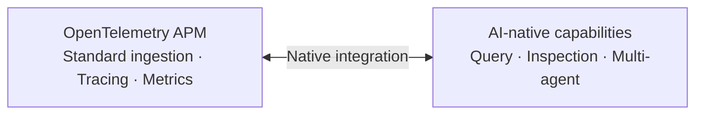
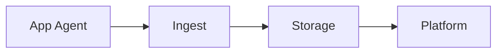
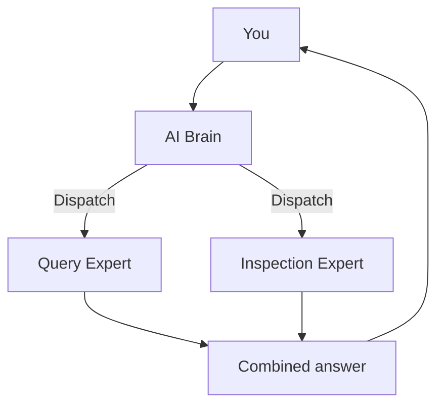

  <a href="产品介绍.md">中文</a>
  &nbsp;|&nbsp;
  <a href="产品介绍_en.md">English</a>

# Product Overview

## In One Sentence

**AI-native OpenTelemetry APM** — ingest standard telemetry first, then let AI understand your system.

---

## Two Standout Highlights

| | OpenTelemetry APM | AI-native |
|--|-------------------|-----------|
| **Positioning** | Standard, reliable data foundation | Intelligent brain that reads telemetry directly |
| **Value** | See traces, metrics, topology, and alerts | Query, inspect, and diagnose through conversation |

---

## Three Pillars of OpenTelemetry APM

### ① Full-featured

Built on OpenTelemetry standard ingestion, covering the full application performance monitoring lifecycle:

- **Troubleshooting** — traffic-light service status to spot anomalies at a glance
- **Distributed tracing** — full call chains; slow requests and errors are easy to find
- **Service metrics** — QPS, latency, error rate, JVM, and other core metrics
- **Service topology** — auto-generated call graphs to understand system architecture quickly

### ② Alerting fundamentals

Covers the basic loop for anomaly detection:

- Flexible threshold and change-detection rules
- Scheduled evaluation of core service metrics
- Alert event records for review and analysis

### ③ Minimal architecture

Say goodbye to bloated APM deployments:

**Only 3 core components** (ingest + storage + platform). One Docker command gets you running. No complex middleware stack — very low operational cost.

---

## Three AI Highlights

### ① AI-native, not a bolt-on chat box

LLM capabilities are **natively integrated** with OpenTelemetry APM data. AI queries traces, metrics, topology, and alerts directly — instead of guessing without context.

### ② Rich capabilities

| Capability | What it does |
|------------|--------------|
| **Natural language query** | Ask for metrics, traces, topology, and alerts in plain language |
| **Service inspection** | Automatically find anomalies without preset thresholds |
| **Incident analysis** | Synthesize multi-source data and deliver diagnostic conclusions |
| **MCP openness** | External agents can call platform capabilities |

### ③ Advanced AI architecture · multi-agent collaboration

- **AI Brain** understands intent and dispatches the right expert
- **Digital experts** each focus on query, inspection, or analysis
- Complex questions can trigger **parallel multi-expert collaboration** — like having an ops team on call

---

## Why DataBuff

| Dimension | Traditional APM | DataBuff |
|-----------|-----------------|----------|
| AI | None or bolt-on | **AI-native, reads telemetry directly** |
| Deployment | Many components, heavy resources | **3 components, minimal deployment** |
| Troubleshooting | Manual chart digging | **Conversational intelligent analysis** |

---

## Use Cases

- You want to **deploy APM quickly** without maintaining a heavy platform
- You want dev/ops teams to **use conversation instead of dashboards**
- You need **open-source, self-hosted** AI ops capabilities
- You are evaluating **AI-native OpenTelemetry APM** for your stack
