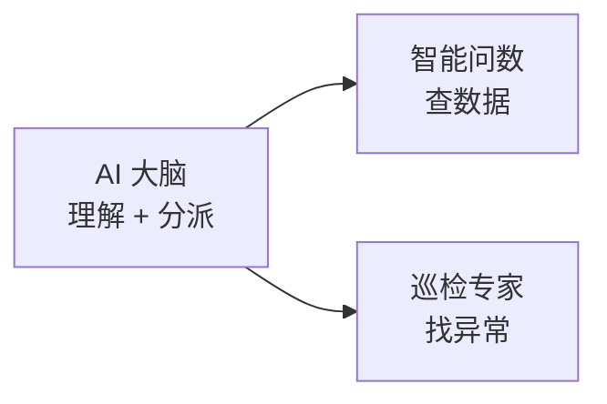
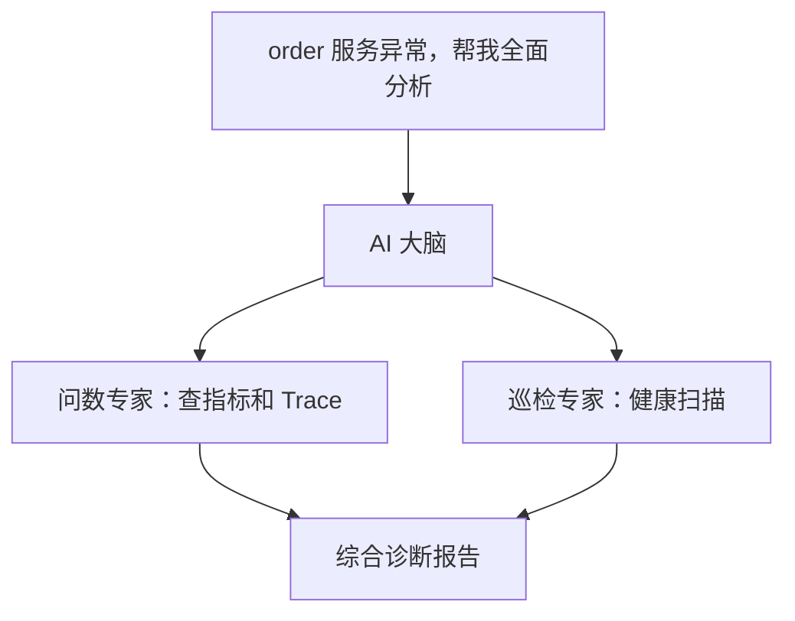

# 使用手册 · AI 平台

## 这是什么

平台的**智能大脑** —— 用对话代替翻图表，用 AI 代替人工排查。

你问，它查数据、做分析、给结论。

---

## 快速上手

1. **配置模型**：配置管理 → 模型配置 → 填入 API Key
2. **开始对话**：AI 平台 → 输入问题
3. **拿到答案**：AI 自动查数据并回复

---

## 三个数字专家

| 专家 | 擅长 | 举例 |
|------|------|------|
| **AI 大脑** | 理解你的问题，派给对的专家 | 「payment 服务最近怎么样？」 |
| **智能问数** | 查指标、Trace、拓扑、告警 | 「order 服务 QPS 趋势」 |
| **巡检专家** | 主动发现服务异常 | 「巡检一下 inventory 服务」 |

> 日常直接跟 **AI 大脑** 对话即可，它会自动路由。

---

## 能帮你做什么

| 场景 | 你可以这样问 |
|------|-------------|
| 看服务健康 | 「哪些服务错误率最高？」 |
| 查性能趋势 | 「order 服务最近 1 小时延迟怎么样？」 |
| 追慢请求 | 「找 5 条最慢的 Trace」 |
| 理清依赖 | 「payment 服务调了谁、被谁调？」 |
| 主动巡检 | 「帮我巡检所有核心服务」 |
| 故障定位 | 「order 错误率突然升高，什么原因？」 |

---

## 多智能体协同

复杂问题不用你拆解 —— **AI 大脑会自动派多个专家并行处理**，最后汇总给你一份完整结论。

这就是 DataBuff 区别于「简单聊天机器人」的核心：**不是陪你聊天，是帮你干活**。
