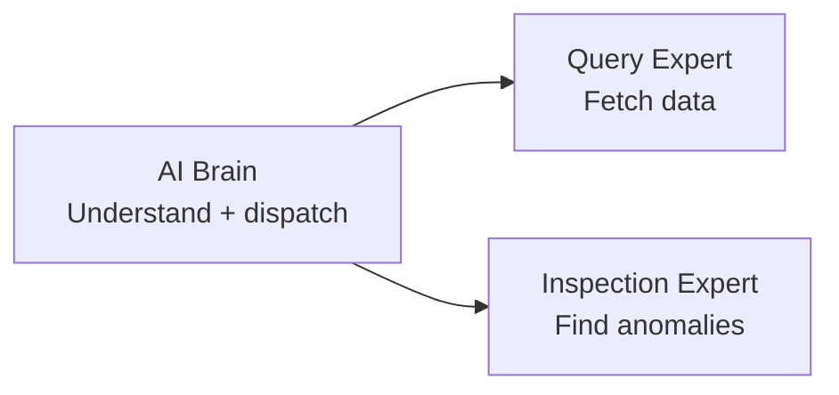
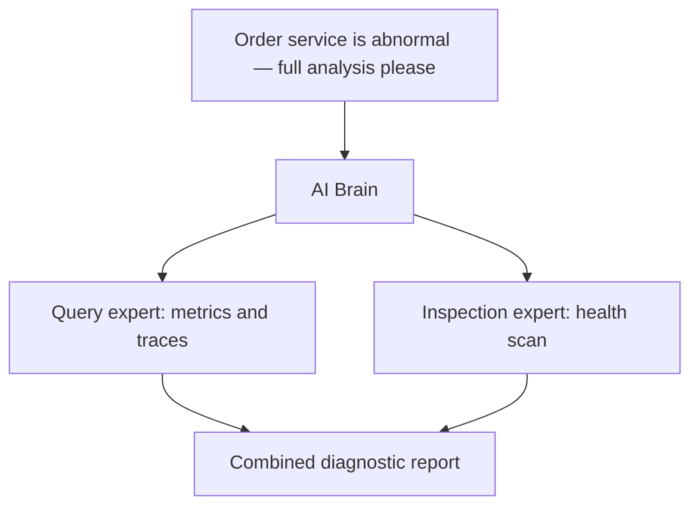

  <a href="AI平台.md">中文</a>
  &nbsp;|&nbsp;
  <a href="AI平台_en.md">English</a>

# User Guide · AI Platform

## What It Is

The platform's **intelligent brain** — use conversation instead of digging through charts, and AI instead of manual troubleshooting.

You ask; it queries data, analyzes, and delivers conclusions.

---

## Quick Start

1. **Configure a model**: Configuration → Model Settings → enter your API key
2. **Start a conversation**: AI Platform → type your question
3. **Get answers**: AI automatically queries data and replies

---

## Three Digital Experts

| Expert | Strength | Example |
|--------|----------|---------|
| **AI Brain** | Understands your question and routes to the right expert | "How is the payment service doing lately?" |
| **Query Expert** | Queries metrics, traces, topology, and alerts | "QPS trend for order service" |
| **Inspection Expert** | Proactively finds service anomalies | "Inspect the inventory service" |

> In daily use, talk directly to the **AI Brain** — it routes automatically.

---

## What It Can Do

| Scenario | Example questions |
|----------|-------------------|
| Service health | "Which services have the highest error rates?" |
| Performance trends | "How was order service latency over the last hour?" |
| Slow requests | "Find the 5 slowest traces" |
| Dependencies | "Who does payment service call, and who calls it?" |
| Proactive inspection | "Inspect all core services for me" |
| Incident triage | "Order error rate spiked — what caused it?" |

---

## Multi-agent Collaboration

For complex questions, you don't need to break them down — the **AI Brain dispatches multiple experts in parallel** and returns one consolidated answer.

This is what sets DataBuff apart from a simple chatbot: **it doesn't just chat — it gets work done**.

---

## Extend External Capabilities

Need to expand the platform boundary? See [Custom Digital Experts](自定义数字专家_en.md) — register MCP, create SPECIALIST experts, and let the AI Brain route tasks automatically.

Need GitHub, browsers, knowledge bases, or other external systems in your AI troubleshooting flow? See [External MCP Integration](外部MCP集成_en.md) — register remote MCP in Tool Management, bind it to a digital expert, and call it from AI chat.
