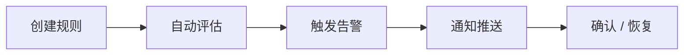

# 使用手册 · 告警

## 这是什么

**主动发现问题** —— 不等用户投诉，指标异常时第一时间通知你。

---

## 告警能帮你做什么

| 能力 | 价值 |
|------|------|
| **阈值告警** | 错误率、延迟超线自动触发 |
| **突变检测** | 捕捉指标的突然变化 |
| **事件收敛** | 同类告警合并，告别告警风暴 |
| **Webhook 通知** | 对接飞书、钉钉、PagerDuty 等 |
| **静默计划** | 发布窗口临时压制，不误报 |

---

## 使用流程

### 1. 创建规则

告警 → 规则管理 → 选择指标、设阈值、指定服务范围。

### 2. 配置通知

告警 → 通知管理 → 填入 Webhook 地址。

### 3. 收到告警后

- 在平台查看告警详情
- 跳转 AI 平台问：「这个告警什么原因？」
- 处理完毕后告警自动恢复

---

## 与 AI 协同

告警不只是「响一声」—— 触发后可以直接问 AI：

> 「order-service 错误率告警，帮我分析原因」

AI 会自动查指标、Trace、拓扑，给出诊断，**从告警到定位一步完成**。
