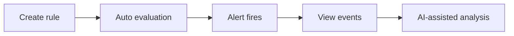

  <a href="告警.md">中文</a>
  &nbsp;|&nbsp;
  <a href="告警_en.md">English</a>

# User Guide · Alerting

## What It Is

**Proactive problem detection** — don't wait for user complaints; record anomalies when metrics go wrong.

---

## What Alerting Does

| Capability | Value |
|------------|-------|
| **Threshold alerts** | Trigger when error rate or latency crosses the line |
| **Change detection** | Catch sudden metric shifts |
| **Event records** | Keep trigger, recovery, and handling context |

---

## Workflow

### 1. Create Rules

Alerts → Rule Management → pick metric, set threshold, define service scope.

### 2. View Events

Alerts → Event List — see trigger time, service, metric, and current status.

### 3. Analyze Alerts

- View alert details in the platform
- Jump to AI Platform and ask: "What caused this alert?"
- Alert auto-recovers after the issue is resolved

---

## Working with AI

An alert is not just a log line — after it fires you can ask AI directly:

> "order-service error rate alert — help me analyze the cause"

AI queries metrics, traces, and topology automatically and delivers a diagnosis — **from alert to root cause in one step**.
