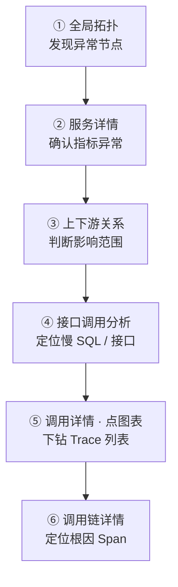
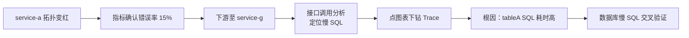

<p align="center">
  <a href="应用性能.md">中文</a>
  &nbsp;|&nbsp;
  <a href="应用性能_en.md">English</a>
</p>

# 使用手册 · 应用性能

## 这是什么

看清你的应用**跑得怎么样** —— 从全局拓扑到每一次调用，逐层下钻定位问题。

DataBuff 应用性能模块基于 OpenTelemetry 标准遥测数据，自动汇聚服务、组件、接口、链路等维度，支持 **拓扑 → 指标 → 链路** 的排查路径。

---

## 核心概念

在使用前，先理解以下七个概念：

| 概念 | 说明 | 在平台中的体现 |
|------|------|---------------|
| **服务** | 一组逻辑相同、承担相同业务职责的应用进程集合，如 `service-a` | 服务列表、服务详情 |
| **虚拟服务** | 应用调用的中间件或外部依赖，本身没有 Agent，由调用方 Trace 自动识别，命名格式为 `[类型]实例名`，如 `[mysql]dcgl`、`[redis]192.168.50.19:31379` | 全局拓扑中的方括号节点、数据库/缓存/MQ 列表 |
| **服务实例** | 服务的单个运行单元，通常对应一个 Pod 或进程 | 服务详情 → 服务关系 → 实例列表 |
| **接口** | 服务对外暴露的具体调用入口，如 HTTP 路径、RPC 方法 | 接口分析、接口详情 |
| **异常** | 请求执行过程中产生的错误，包括 HTTP 5xx、Java Exception 等 | 错误分析、服务详情错误率、Trace 错误标记 |
| **服务流** | 服务之间调用的有向关系图，展示"谁调谁" | 服务流页面、服务详情 → 服务关系 |
| **链路追踪（Trace）** | 一次完整请求从入口到各下游的全链路记录，由多个 Span 组成 | 链路追踪、调用链详情 |

**服务 vs 虚拟服务**：服务是安装了 Agent 的应用本身；虚拟服务是应用访问的数据库、缓存、消息队列等组件，平台从出站 Span 中自动提取，无需单独接入。

---

## 最佳实践：拓扑 → 指标 → 链路

排查性能或故障问题时，推荐按以下路径逐层下钻，**先宏观后微观，先定位范围再追根因**：



| 步骤 | 做什么 | 入口 |
|------|--------|------|
| ① 拓扑 | 全局扫描，找到变红/变黄的服务或组件 | 应用性能 → **全局拓扑** |
| ② 指标 | 进入异常服务，看响应时间、错误率、调用数趋势 | 点击拓扑节点 → **服务详情** |
| ③ 上下游 | 确认是自身问题还是下游传递 | 服务详情 → **服务关系** |
| ④ 接口/组件 | 定位到具体接口、SQL 或中间件调用 | 服务详情 → **接口调用分析** |
| ⑤ 调用详情 | 在指标图上点击异常时间点，下钻 Trace 列表 | **接口调用出入口详情** → 点击图表 |
| ⑥ 链路 | 打开具体 Trace，找到最慢或报错的 Span | 调用链详情 |

> **注意**：入口服务变红，根因往往在更下游。不要停在第一个异常节点，要沿调用链继续往下查。

也可以直接跳到 **AI 平台**，用对话完成上述全部步骤。

---

## 实战案例：service-a 爆红，根因在 service-g 的 SQL

以下以测试环境 `192.168.50.140:27403` 中 **2026-06-20 06:48–07:03** 时段的真实数据为例，演示完整排查流程。

**现象**：全局拓扑中 `service-a` 节点变红；同时 `service-c` 也有异常。

**结论**：沿调用链向下游排查至 service-g，在 **接口调用分析** 中定位到访问 `[mysql]dcgl` 的 SQL `select * from tableA limit ?` 响应时间异常，点击耗时高点下钻 Trace 确认 SQL Span 耗时过高；再从 **数据库详情 → 慢 SQL** 交叉验证，该语句慢调用次数最多（242 次），导致上游 service-a 错误率飙升。

---

### 步骤 ① 全局拓扑 · 发现异常

**应用性能 → 全局拓扑**，一眼看到 `service-a` 节点为红色，表示该服务在当前时间窗口内存在错误或性能异常。


点击 `service-a` 节点，进入服务详情。

---

### 步骤 ② 服务详情 · 确认指标

在服务详情 **基础信息** 页，三个核心指标图印证异常：

- **响应时间**：07:02 附近出现尖峰，最高接近 9s
- **调用数**：末尾出现红色失败段
- **错误率**：从 0% 骤升至约 15%


> 示例 URL：`/appMonitor/serviceDetail?sn=service-a&sid=9bf61532d56eb7b5&activeName=tab-baseinfo`

---

### 步骤 ③ 沿调用链向下游 · 定位到 service-g

切换到 **服务关系** 页，查看 service-a 的上下游：

- **上游**：1 个 HTTP 调用方
- **下游**：3 个 HTTP 服务 + 2 个 RPC 服务

service-a 自身指标异常，但根因往往在下游。**沿调用链逐层进入下游服务**，最终进入 **service-g 服务详情 → 服务关系**，可看到其下游连接了 `[mysql]dcgl` 数据库组件。

点击下游 `[mysql]dcgl` 节点，进入 **接口调用分析** 页（发起方 service-g → 接收方 `[mysql]dcgl`），在 SQL 列表中按响应时间排序，找到耗时最高的语句：`select * from tableA limit ?`。

> 此段为页面内跳转，不再重复截图。

---

### 步骤 ④ 接口调用出入口详情 · 点击耗时高点

点击该 SQL 行，进入 **接口调用出入口详情** 页，查看这条 SQL 的专项指标：

- **发出调用者**：service-g
- **接收调用者**：`[mysql]dcgl`
- **响应时间对比**：07:00 之前稳定在 300ms 以内，07:01 起骤升至约 1.2s


页面底部提示 **「点击图中任意点，查看详细请求」**——在 **响应时间对比** 图上点击 07:02 附近的耗时高点，系统自动展开该时段的 Trace 列表，按响应时间降序排列。

> 示例 URL：`/appMonitor/serviceCallDetail?componentType=service.db&resource=select * from tableA limit ?&sn=[mysql]dcgl&srcSn=service-g&...`

---

### 步骤 ⑤ 调用链详情 · 确认 SQL Span 耗时

从 Trace 列表中选择一条耗时最高的记录，进入 **调用链详情**。

在瀑布图中展开调用路径，可看到：

```
service-a → … → service-g → select * from tableA limit ?（[mysql]dcgl）
```

**根因 Span** 即 service-g 对 `[mysql]dcgl` 执行的 `select * from tableA limit ?`——该 SQL 执行耗时显著高于其他 Span，慢调用沿链路向上传递，最终导致 service-a 错误率飙升、拓扑节点变红。

---

### 步骤 ⑥ 数据库慢 SQL · 交叉验证

从组件视角进一步确认：**应用性能 → 数据库 → 点击 `[mysql]dcgl`**，进入数据库详情，切换到 **慢 SQL** Tab。

慢 SQL 列表按调用次数排序，`select * from tableA limit ?` 的慢调用次数最多（242 次），平均响应时间 1.03s、最大 4.63s，与步骤 ④⑤ 的结论一致。


> 示例 URL：`/appMonitor/database/detail?sn=[mysql]dcgl&sid=d8fee765095c69d8&activeName=tab-sql`

从数据库详情页也可点击该 SQL 行，进一步跳转到接口调用出入口详情或 Trace，完成双向验证。

---

### 案例小结



| 阶段 | 看到什么 | 下一步 |
|------|---------|--------|
| 拓扑 | service-a 红色 | 进入服务详情 |
| 指标 | 错误率/延迟尖峰 | 查上下游关系 |
| 下游 | service-g 连接 `[mysql]dcgl` | 点击 DB 节点 → 接口调用分析 |
| 调用分析 | `select * from tableA limit ?` 响应时间最高 | 进入接口调用出入口详情 |
| 调用详情 | 响应时间 07:02 飙至 1.2s | 点击图表耗时高点 |
| 链路 | SQL Span 耗时最高 | 数据库慢 SQL 交叉验证 |
| 慢 SQL | `tableA` 慢调用 242 次最多 | 优化 SQL / 加索引 |

---

## 功能速查

| 能力 | 入口 | 适用场景 |
|------|------|---------|
| 全局拓扑 | 应用性能 → 全局拓扑 | 全局健康扫描、理解架构 |
| 服务列表 | 应用性能 → 服务 | 按指标排序找 Top 异常服务 |
| 服务详情 | 点击服务名 | 单服务指标、上下游、实例 |
| 接口分析 | 服务详情 → 接口分析 | 定位慢接口/高错误接口 |
| 接口调用分析 | 服务详情 → 下游组件 | 看服务调了哪些 DB/MQ/外部服务，定位慢 SQL |
| 接口调用出入口详情 | 接口调用分析 → 点击具体 SQL/接口 | 单条调用的指标趋势，点击图表下钻 Trace |
| 服务流 | 应用性能 → 服务流 | 服务间流向全局视图 |
| 错误分析 | 应用性能 → 错误分析 | 按异常类型聚合 |
| 链路追踪 | 应用性能 → 链路追踪 | 追单次请求的完整路径 |
| 数据库详情 | 应用性能 → 数据库 → 点击实例 | 慢 SQL Tab 按调用次数找 Top 慢语句 |
| 数据库/缓存/MQ | 应用性能 → 对应菜单 | 中间件组件视角排查 |
