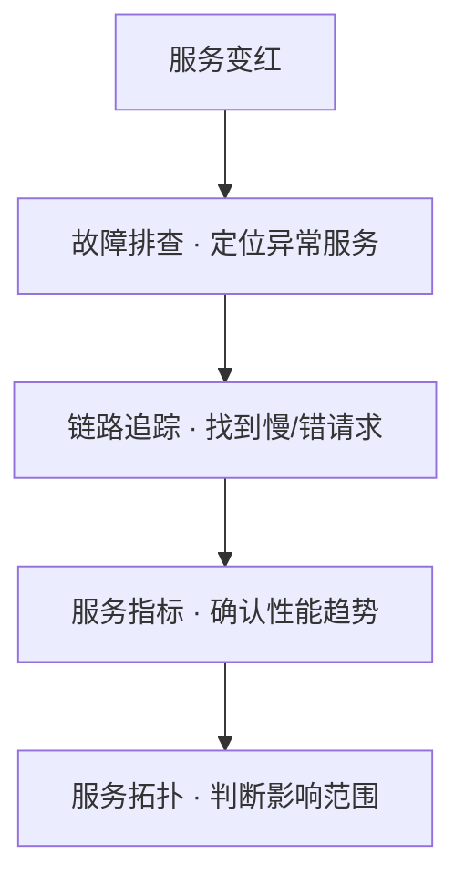

# 使用手册 · 应用性能

## 这是什么

看清你的应用**跑得怎么样** —— 从宏观健康度到微观每一次调用。

---

## 四大核心能力

### 故障排查 · 红绿灯

一眼看清所有服务的健康状态：

| 颜色 | 含义 |
|------|------|
| 🟢 绿 | 运行正常 |
| 🟡 黄 | 需要关注 |
| 🔴 红 | 存在异常 |

**价值**：不用逐个服务点进去看，全局扫描，秒级定位问题服务。

### 链路追踪

一次请求的完整旅程 —— 经过了哪些服务、哪一步最慢、哪里出了错。

**价值**：慢请求和错误不再靠猜，调用链说话。

### 服务指标

QPS、延迟（P50/P95/P99）、错误率、JVM 等核心指标，支持趋势查看。

**价值**：量化性能变化，为容量规划和优化提供依据。

### 服务拓扑

自动绘制服务间调用关系图。

**价值**：新人快速理解系统架构，故障时理清影响范围。

---

## 典型使用路径

1. **红绿灯发现异常** → 2. **Trace 定位具体请求** → 3. **指标确认趋势** → 4. **拓扑评估影响**

也可以直接跳到 **AI 平台**，用对话完成上述全部步骤。
