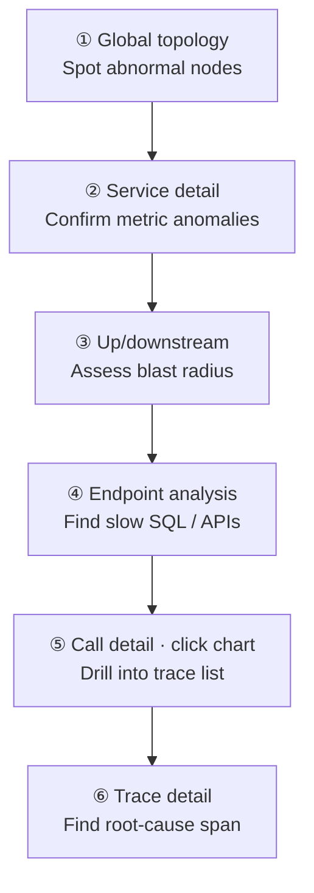
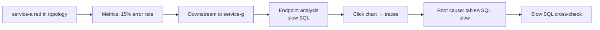

<p align="center">
  <a href="应用性能.md">中文</a>
  &nbsp;|&nbsp;
  <a href="应用性能_en.md">English</a>
</p>

# User Guide · Application Performance

## What It Is

See how your applications **actually perform** — from global topology down to every call, drilling layer by layer to find issues.

The DataBuff application performance module aggregates services, components, endpoints, and traces from OpenTelemetry telemetry, supporting a **topology → metrics → traces** troubleshooting path.

---

## Core Concepts

Understand these seven concepts before you start:

| Concept | Description | In the platform |
|---------|-------------|-----------------|
| **Service** | A set of logically identical processes with the same business role, e.g. `service-a` | Service list, service detail |
| **Virtual service** | Middleware or external dependency called by an app — no agent of its own; inferred from caller traces, named `[type]instance`, e.g. `[mysql]dcgl`, `[redis]192.168.50.19:31379` | Bracket nodes in global topology; database/cache/MQ lists |
| **Service instance** | A single runtime unit of a service, usually a Pod or process | Service detail → Relationships → Instance list |
| **Endpoint** | A concrete entry point exposed by a service, e.g. HTTP path or RPC method | Endpoint analysis, endpoint detail |
| **Error** | Failures during request execution — HTTP 5xx, Java exceptions, etc. | Error analysis, service error rate, error markers on traces |
| **Service flow** | Directed graph of service-to-service calls — "who calls whom" | Service flow page, service detail → Relationships |
| **Distributed trace** | Full path of one request from entry through downstreams, made of spans | Trace search, trace detail |

**Service vs virtual service**: A service is the instrumented application itself; a virtual service is a database, cache, or message queue the app accesses — extracted automatically from outbound spans, no separate ingestion required.

---

## Best Practice: Topology → Metrics → Traces

For performance or incident triage, drill down in this order — **macro first, then micro; narrow scope before root cause**:



| Step | What to do | Entry |
|------|------------|-------|
| ① Topology | Global scan for red/yellow services or components | Application Performance → **Global Topology** |
| ② Metrics | Open abnormal service; check latency, error rate, call volume | Click topology node → **Service Detail** |
| ③ Up/downstream | Decide if issue is local or propagated | Service detail → **Relationships** |
| ④ Endpoint/component | Pinpoint API, SQL, or middleware call | Service detail → **Endpoint Call Analysis** |
| ⑤ Call detail | Click abnormal point on metric chart to open trace list | **Endpoint Call Detail** → click chart |
| ⑥ Trace | Open a trace; find slowest or failing span | Trace detail |

> **Note**: When an entry service turns red, root cause is often further downstream. Don't stop at the first red node — follow the call chain.

You can also skip straight to **AI Platform** and do all of the above through conversation.

---

## Walkthrough: service-a Red in Topology, Root Cause Is SQL in service-g

This example uses real data from test environment `192.168.50.140:27403` during **2026-06-20 06:48–07:03**.

**Symptom**: `service-a` is red in global topology; `service-c` is also abnormal.

**Conclusion**: Follow the call chain downstream to service-g. In **Endpoint Call Analysis**, the SQL `select * from tableA limit ?` to `[mysql]dcgl` shows high latency. Click the latency spike on the chart to drill into traces and confirm the SQL span is slow. Cross-check in **Database Detail → Slow SQL** — that statement has the most slow calls (242), driving service-a error rate up.

---

### Step ① Global Topology · Spot Anomaly

**Application Performance → Global Topology** — `service-a` is red, indicating errors or performance issues in the time window.


Click the `service-a` node to open service detail.

---

### Step ② Service Detail · Confirm Metrics

On the **Basic Info** tab, three core charts confirm the issue:

- **Response time**: spike near 07:02, peaking near 9s
- **Call volume**: red failure segment at the end
- **Error rate**: jumps from 0% to ~15%


> Example URL: `/appMonitor/serviceDetail?sn=service-a&sid=9bf61532d56eb7b5&activeName=tab-baseinfo`

---

### Step ③ Follow Call Chain Downstream · Reach service-g

Switch to **Relationships** for service-a:

- **Upstream**: 1 HTTP caller
- **Downstream**: 3 HTTP services + 2 RPC services

service-a metrics are bad, but root cause is often downstream. **Follow downstream services layer by layer** until **service-g detail → Relationships**, which shows downstream `[mysql]dcgl`.

Click `[mysql]dcgl` to open **Endpoint Call Analysis** (caller service-g → callee `[mysql]dcgl`). Sort SQL by response time — highest: `select * from tableA limit ?`.

> This section is in-page navigation; no extra screenshot.

---

### Step ④ Endpoint Call Detail · Click Latency Spike

Click that SQL row for **Endpoint Call Detail**:

- **Caller**: service-g
- **Callee**: `[mysql]dcgl`
- **Response time comparison**: stable under 300ms before 07:00; jumps to ~1.2s from 07:01


The page prompts **"Click any point on the chart to view requests"** — click the spike near 07:02 on **Response time comparison** to open traces sorted by latency.

> Example URL: `/appMonitor/serviceCallDetail?componentType=service.db&resource=select * from tableA limit ?&sn=[mysql]dcgl&srcSn=service-g&...`

---

### Step ⑤ Trace Detail · Confirm SQL Span

Pick the slowest trace from the list and open **Trace Detail**.

In the waterfall:

```
service-a → … → service-g → select * from tableA limit ? ([mysql]dcgl)
```

**Root-cause span**: service-g executing `select * from tableA limit ?` on `[mysql]dcgl` — much slower than other spans; latency propagates upstream and turns service-a red.

---

### Step ⑥ Database Slow SQL · Cross-check

From the component view: **Application Performance → Database → `[mysql]dcgl`**, open **Slow SQL** tab.

Sorted by call count, `select * from tableA limit ?` has the most slow calls (242), avg 1.03s, max 4.63s — consistent with steps ④ and ⑤.


> Example URL: `/appMonitor/database/detail?sn=[mysql]dcgl&sid=d8fee765095c69d8&activeName=tab-sql`

From database detail you can also click the SQL row to jump to endpoint call detail or traces for bidirectional verification.

---

### Case Summary



| Phase | What you see | Next step |
|-------|--------------|-----------|
| Topology | service-a red | Open service detail |
| Metrics | Error rate / latency spike | Check relationships |
| Downstream | service-g → `[mysql]dcgl` | DB node → endpoint call analysis |
| Call analysis | `select * from tableA limit ?` highest latency | Open endpoint call detail |
| Call detail | Latency ~1.2s at 07:02 | Click chart spike |
| Trace | SQL span slowest | Slow SQL cross-check |
| Slow SQL | tableA: 242 slow calls | Optimize SQL / add index |

---

## Feature Quick Reference

| Capability | Entry | Use case |
|------------|-------|----------|
| Global topology | Application Performance → Global Topology | Health scan, architecture overview |
| Service list | Application Performance → Services | Sort by metrics to find top offenders |
| Service detail | Click service name | Per-service metrics, relationships, instances |
| Endpoint analysis | Service detail → Endpoint analysis | Slow or high-error endpoints |
| Endpoint call analysis | Service detail → downstream component | Which DB/MQ/external calls; slow SQL |
| Endpoint call detail | Endpoint call analysis → click SQL/endpoint | Per-call metrics; click chart → traces |
| Service flow | Application Performance → Service Flow | Global service-to-service view |
| Error analysis | Application Performance → Error Analysis | Aggregate by exception type |
| Trace search | Application Performance → Traces | Full path of one request |
| Database detail | Application Performance → Database → instance | Slow SQL tab by call count |
| Database / cache / MQ | Application Performance → respective menu | Component-centric troubleshooting |
