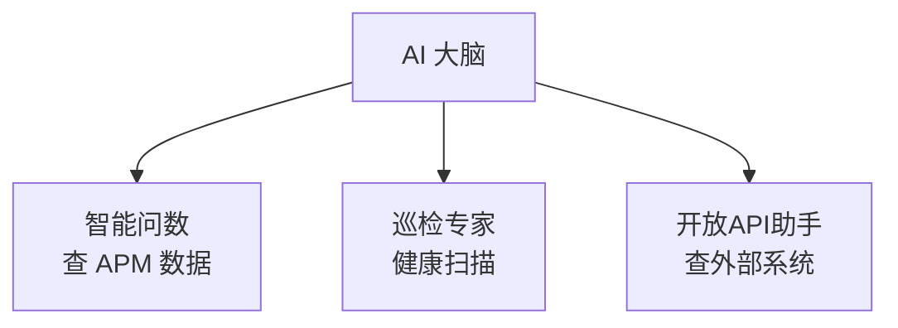

<p align="center">
  <a href="自定义数字专家.md">中文</a>
  &nbsp;|&nbsp;
  <a href="自定义数字专家_en.md">English</a>
</p>

# 使用手册 · 自定义数字专家

除了内置的 **AI 大脑、智能问数、巡检专家**，你还可以创建**自定义数字专家**，绑定远程 MCP 工具，把 SkyWalking、Prometheus、Zabbix 等外部系统能力接入对话流程。

**四步完成：** 注册 MCP → 创建专家 → 绑定工具 → 对话使用

---

## 整体流程


| 步骤 | 操作 | 说明 |
|------|------|------|
| ① | 注册 MCP 工具 | 工具管理 → MCP 工具 → 新建 MCP |
| ② | 创建自定义专家 | 数字专家 → 新建专家，类型选 SPECIALIST |
| ③ | 绑定 MCP | 专家 Tools 白名单中勾选 MCP Tool ID |
| ④ | 对话验证 | AI 对话直接向 AI 大脑提问，大脑自动路由 |

> MCP 注册细节见 [外部 MCP 集成](外部MCP集成.md)。

---

## ① 注册 MCP 工具

**AI 平台 → 工具管理 → MCP 工具 → 新建 MCP**

| 字段 | 示例 |
|------|------|
| Tool ID | `open-api` |
| 连接地址 | `http://your-mcp-host:18900/sse` |
| 协议 | SSE |
| 状态 | 启用 |


保存后，该 MCP 暴露的工具会在专家运行时自动注册，供专家调用。

---

## ② 创建自定义数字专家

**AI 平台 → 数字专家 → 新建专家**

### 基础信息

| 字段 | 示例 | 说明 |
|------|------|------|
| Expert ID | `openapi` | 全局唯一标识 |
| 名称 | 开放API助手 | 展示名称 |
| 类型 | **SPECIALIST** | 可被 AI 大脑派发的专业专家 |
| 分类 | 外部集成 | 便于分组管理 |
| 描述 | 通过 MCP 调用外部 Open API… | 写清职责，有助于大脑自动路由 |
| 状态 | 启用 | 禁用后大脑不再派发 |


### 能力与 Prompt

| 字段 | 示例 |
|------|------|
| 工具模式 | 白名单（ALLOWLIST） |
| Tools | 勾选 `open-api` |
| Skills | 可选 |
| Prompt | 见下方示例 |

**Prompt 示例：**

```text
你是 DataBuff APM 开放 API 助手，负责通过 MCP 工具 open-api 调用外部系统（SkyWalking、Prometheus、Zabbix 等）。

工作原则：
1. 优先调用 open-api MCP 暴露的工具完成任务。
2. 必须基于工具返回的真实数据回答，不要编造。
3. 用中文回答，说明调用了哪些外部工具。
```

保存后，专家列表中会出现新专家，能力列显示已绑定的 Tools 数量。

---

## ③ AI 大脑自动路由

无需修改 AI 大脑配置。自定义专家启用后，AI 大脑会自动将其纳入可派发列表，根据用户问题和专家描述选择最合适的专家执行。

用户始终只与 **AI 大脑** 对话，复杂协作在后台完成。

---

## ④ 对话验证

**AI 平台 → AI 对话**，直接向 AI 大脑提问：

```text
通过外部 API 查询 SkyWalking 当前有哪些服务
```

### 你会看到什么

1. **AI 大脑**理解问题，调用 `dispatchExpertTask` 派发给 **开放API助手**
2. **开放API助手**通过 `open-api` MCP 调用外部工具（如 `listSkyWalkingLayers`、`listSkyWalkingServices`）
3. 专家完成后，**AI 大脑**汇总结果回复用户

展开思考过程，可清晰看到各专家的协作链路：


对话输入框下方也会出现 **开放API助手** 等自定义专家快捷入口，表示该专家已纳入平台能力体系。

---

## 专家类型说明

| 类型 | 用途 |
|------|------|
| **BRAIN** | 唯一入口，负责理解、派发、汇总（使用内置 AI 大脑，勿重复创建） |
| **SPECIALIST** | 专业执行者，可被大脑派发（自定义专家推荐选此类型） |
| **CUSTOM** | 通用自定义类型 |

---

## 与内置专家的分工



| 专家 | 擅长 |
|------|------|
| 智能问数 | 查 DataBuff 自身 APM 指标、Trace、拓扑 |
| 巡检专家 | 服务健康巡检与异常诊断 |
| 自定义专家 | 通过 MCP 查外部系统数据 |

---

## 相关文档

- [AI 平台](AI平台.md)
- [外部 MCP 集成](外部MCP集成.md)
