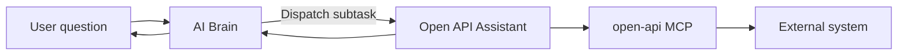
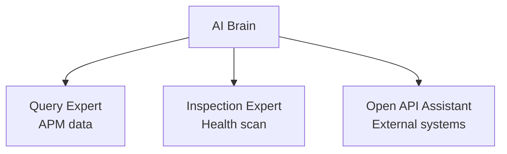

<p align="center">
  <a href="自定义数字专家.md">中文</a>
  &nbsp;|&nbsp;
  <a href="自定义数字专家_en.md">English</a>
</p>

# User Guide · Custom Digital Experts

Beyond the built-in **AI Brain, Query Expert, and Inspection Expert**, you can create **custom digital experts**, bind remote MCP tools, and connect external systems such as SkyWalking, Prometheus, and Zabbix into the conversation flow.

**Four steps:** Register MCP → Create expert → Bind tools → Verify in chat

---

## Overall Flow



| Step | Action | Notes |
|------|--------|-------|
| ① | Register MCP tool | Tool Management → MCP Tools → New MCP |
| ② | Create custom expert | Digital Experts → New Expert, type **SPECIALIST** |
| ③ | Bind MCP | Check MCP Tool ID in expert Tools allowlist |
| ④ | Verify in chat | Ask the AI Brain directly; it routes automatically |

> MCP registration details: [External MCP Integration](外部MCP集成_en.md).

---

## ① Register MCP Tool

**AI Platform → Tool Management → MCP Tools → New MCP**

| Field | Example |
|-------|---------|
| Tool ID | `open-api` |
| Connection URL | `http://your-mcp-host:18900/sse` |
| Protocol | SSE |
| Status | Enabled |


After saving, tools exposed by this MCP are registered at runtime for the expert to call.

---

## ② Create Custom Digital Expert

**AI Platform → Digital Experts → New Expert**

### Basic Info

| Field | Example | Notes |
|-------|---------|-------|
| Expert ID | `openapi` | Globally unique |
| Name | Open API Assistant | Display name |
| Type | **SPECIALIST** | Professional expert dispatchable by AI Brain |
| Category | External integration | For grouping |
| Description | Call external Open API via MCP… | Clear scope helps auto-routing |
| Status | Enabled | Disabled experts are not dispatched |


### Capabilities and Prompt

| Field | Example |
|-------|---------|
| Tool mode | Allowlist (ALLOWLIST) |
| Tools | Check `open-api` |
| Skills | Optional |
| Prompt | See example below |

**Prompt example:**

```text
You are the DataBuff APM Open API assistant. Use the MCP tool open-api to call external systems (SkyWalking, Prometheus, Zabbix, etc.).

Principles:
1. Prefer open-api MCP tools to complete tasks.
2. Answer only from real tool responses — do not fabricate data.
3. Reply in English and state which external tools were called.
```

After saving, the new expert appears in the list with bound Tools count in the capabilities column.

---

## ③ AI Brain Auto-routing

No AI Brain config changes are required. When a custom expert is enabled, the AI Brain includes it in the dispatch list and picks the best match from the user question and expert description.

Users always talk only to the **AI Brain**; complex collaboration happens in the background.

---

## ④ Verify in Chat

**AI Platform → AI Chat**, ask the AI Brain directly:

```text
Query SkyWalking via external API — which services exist right now?
```

### What You Will See

1. **AI Brain** understands the question and calls `dispatchExpertTask` to send work to **Open API Assistant**
2. **Open API Assistant** calls external tools via `open-api` MCP (e.g. `listSkyWalkingLayers`, `listSkyWalkingServices`)
3. When the expert finishes, **AI Brain** summarizes and replies

Expand the reasoning trace to see the full multi-expert chain:


Shortcut entries such as **Open API Assistant** also appear below the chat input, indicating the expert is part of the platform.

---

## Expert Types

| Type | Purpose |
|------|---------|
| **BRAIN** | Single entry point — understand, dispatch, summarize (use built-in AI Brain; do not duplicate) |
| **SPECIALIST** | Professional executor dispatchable by AI Brain (recommended for custom experts) |
| **CUSTOM** | Generic custom type |

---

## Division of Labor with Built-in Experts



| Expert | Strength |
|--------|----------|
| Query Expert | DataBuff APM metrics, traces, topology |
| Inspection Expert | Service health inspection and anomaly diagnosis |
| Custom expert | External system data via MCP |

---

## Related Docs

- [AI Platform](AI平台_en.md)
- [External MCP Integration](外部MCP集成_en.md)
