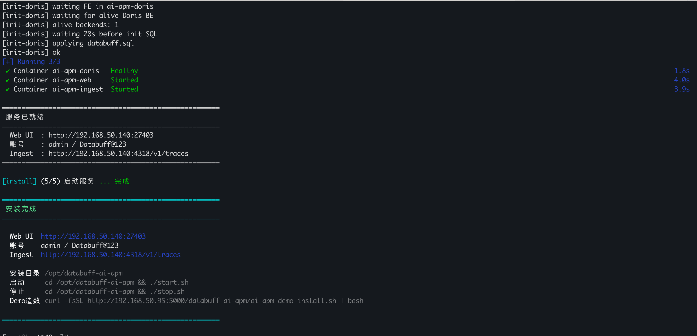
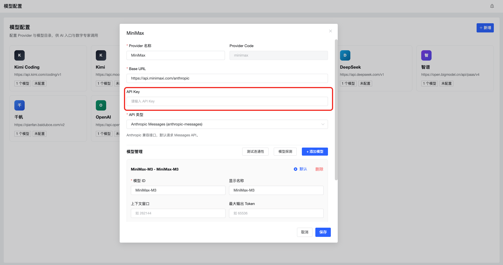

<p align="center">
  <a href="docker安装部署.md">中文</a>
  &nbsp;|&nbsp;
  <a href="docker安装部署_en.md">English</a>
</p>

# Docker Installation

Get DataBuff running in 5 minutes — platform, storage, and ingest in one command.

## 1. Prerequisites

- Docker
- Docker Compose

## 2. Install the Platform

```bash
curl -fsSL https://databuff.ai/databuff/ai-apm-install.sh | bash
```

After installation, the terminal prints the Web UI URL, credentials, and OTLP endpoint.

Install a specific version:

```bash
curl -fsSL https://databuff.ai/databuff/ai-apm-install.sh | bash -s -- --version 0.1.1
# or
APM_VERSION=0.1.1 curl -fsSL https://databuff.ai/databuff/ai-apm-install.sh | bash
```



Common commands:

```bash
cd /opt/databuff-ai-apm
docker-compose up -d
docker-compose down
```

## 3. Install the Demo (Optional)

Let the demo app continuously report traces so you can see call chains and topology in the platform.

```bash
curl -fsSL https://databuff.ai/databuff/ai-apm-demo-install.sh | bash
```

## 4. Enable AI

Go to **Configuration → Model Settings** and enter your API key:



You can now ask questions like:

> Why is order-service getting slower?
