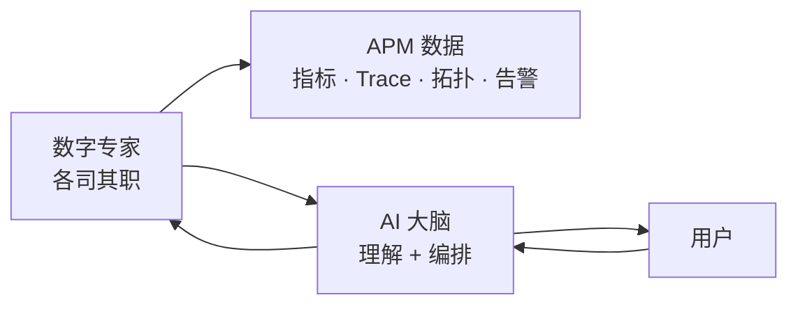
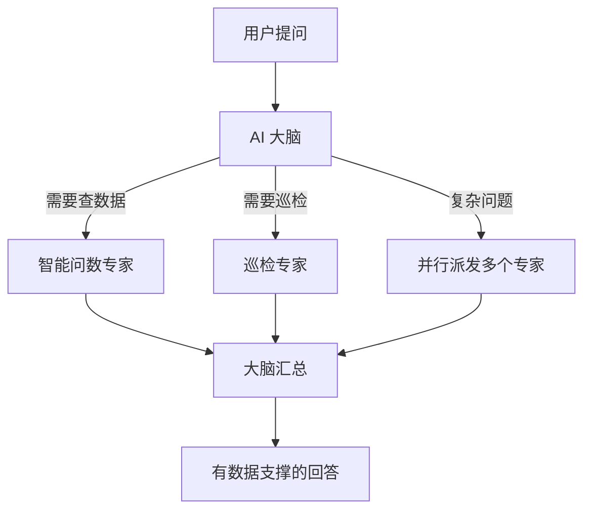
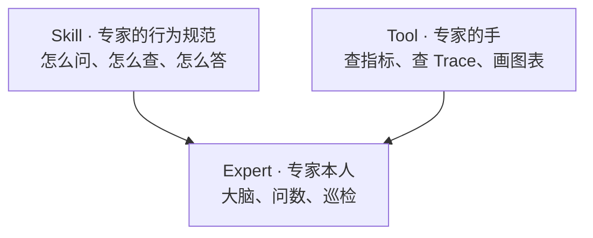
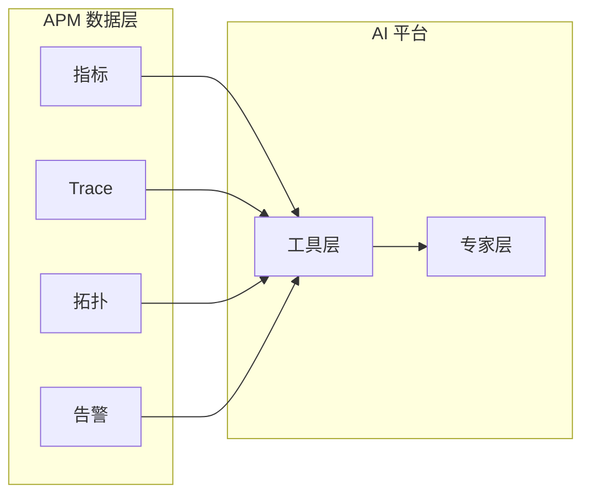

  <a href="AI平台.md">中文</a>
  &nbsp;|&nbsp;
  <a href="AI平台_en.md">English</a>

# 架构设计 · AI 平台

## 设计初衷

传统 APM 的 AI 往往是「外挂聊天框」—— 看不懂真实数据，回答靠猜。

DataBuff 的 AI 平台从第一天就按 **AI 原生** 设计：**AI 直接读 OpenTelemetry APM 数据，多专家协同干活**。

---

## 核心理念

| 原则 | 说明 |
|------|------|
| **数据驱动** | AI 回答必须基于真实 APM 数据，不编造 |
| **专家分工** | 不同场景由不同专家处理，比单一模型更准 |
| **大脑编排** | 用户只面对一个入口，复杂协作在后台完成 |
| **开放扩展** | Skill 定义专家行为，Tool 扩展能力边界 |

---

## 多智能体协同架构

**为什么用多智能体，而不是一个大模型？**

| | 单一大模型 | 多智能体协同 |
|--|-----------|-------------|
| 准确性 | 通用回答，容易泛泛而谈 | 专家专注领域，查询更精准 |
| 可扩展 | 加能力 = 加 prompt，难维护 | 加专家 = 加模块，互不影响 |
| 复杂任务 | 容易遗漏步骤 | 大脑拆解、专家并行、结果汇总 |
| 可信度 | 可能编造数据 | 每个专家必须调工具查真实数据 |

---

## 三层能力体系

| 层 | 作用 | 举例 |
|----|------|------|
| **Expert** | 面向用户的智能角色 | AI 大脑、智能问数、巡检 |
| **Tool** | 专家可调用的原子能力 | 查服务列表、查 Trace、画趋势图 |
| **Skill** | 约束专家的行为规则 | 问数口径、巡检流程、路由策略 |

新增能力 = 组合 Tool + 编写 Skill + 注册 Expert，**不用改核心代码**。

---

## 与 APM 的原生融合

AI 不是独立系统 —— 它直接长在 APM 数据之上。这意味着：

- 问「错误率」→ 查的是真实 Doris 指标，不是幻觉
- 问「慢 Trace」→ 拉的是真实链路数据
- 问「服务关系」→ 画的是真实拓扑

**这是「AI 原生 OpenTelemetry APM」与「APM + 聊天框」的本质区别。**

---

## 开放生态

- **多模型支持**：OpenAI 兼容、Anthropic 等主流 LLM 即配即用
- **MCP 协议**：外部 Agent（如 Cursor、Claude）可调用平台能力；平台也可作为 MCP 客户端接入外部 MCP 服务
- **Skill 可定制**：内置 Skill 可覆盖，支持按业务场景扩展

接入外部 MCP、创建可被大脑路由的自定义专家，见 [使用手册 · 自定义数字专家](../使用手册/自定义数字专家.md) 与 [外部 MCP 集成](../使用手册/外部MCP集成.md)。
