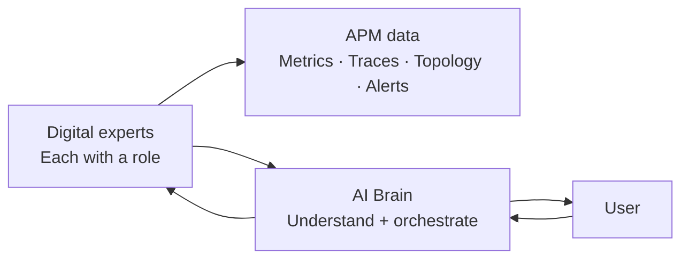
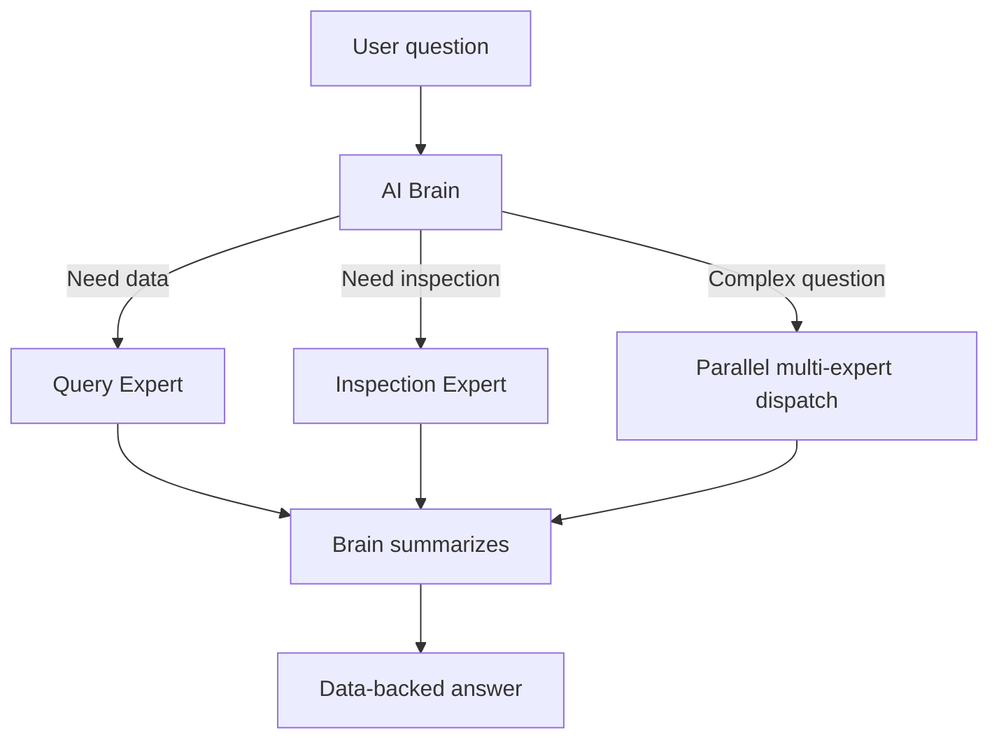
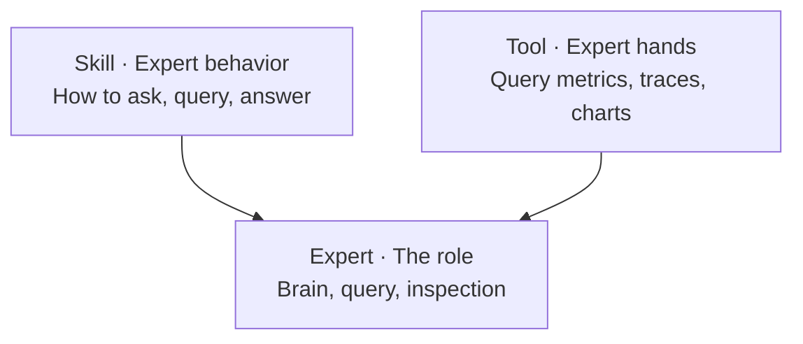
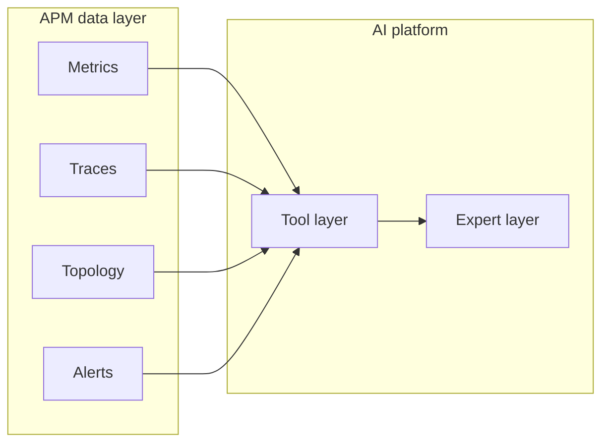

  <a href="AI平台.md">中文</a>
  &nbsp;|&nbsp;
  <a href="AI平台_en.md">English</a>

# Architecture · AI Platform

## Design Intent

AI in traditional APM is often a "bolt-on chat box" — it cannot read real data and guesses answers.

DataBuff's AI platform was **AI-native from day one**: **AI reads OpenTelemetry APM data directly; multiple experts work together**.

---

## Core Principles

| Principle | Description |
|-----------|-------------|
| **Data-driven** | Answers must come from real APM data — no fabrication |
| **Expert specialization** | Different scenarios handled by different experts — more accurate than one model |
| **Brain orchestration** | Users see one entry; complex collaboration runs in the background |
| **Open extension** | Skills define behavior; Tools extend capability boundaries |

---

## Multi-agent Architecture

**Why multi-agent instead of one large model?**

| | Single large model | Multi-agent |
|--|-------------------|-------------|
| Accuracy | Generic answers, easy to stay shallow | Experts focus on domain; queries are precise |
| Extensibility | New capability = more prompt, hard to maintain | New expert = new module, isolated |
| Complex tasks | Easy to miss steps | Brain decomposes, experts parallelize, results merge |
| Trust | May hallucinate data | Each expert must call tools for real data |

---

## Three-layer Capability Model

| Layer | Role | Examples |
|-------|------|----------|
| **Expert** | User-facing intelligent role | AI Brain, Query Expert, Inspection Expert |
| **Tool** | Atomic capabilities experts can call | List services, query traces, plot trends |
| **Skill** | Rules constraining expert behavior | Query semantics, inspection flow, routing |

New capability = combine Tools + write Skill + register Expert — **no core code changes**.

---

## Native Integration with APM

AI is not a separate system — it grows directly on APM data. That means:

- Ask "error rate" → queries real Doris metrics, not hallucinations
- Ask "slow traces" → pulls real trace data
- Ask "service relationships" → draws real topology

**This is the essential difference between "AI-native OpenTelemetry APM" and "APM + chat box".**

---

## Open Ecosystem

- **Multi-model support**: OpenAI-compatible, Anthropic, and other mainstream LLMs
- **MCP protocol**: External agents (e.g. Cursor, Claude) can call platform capabilities; the platform can also act as MCP client to external MCP services
- **Customizable Skills**: Built-in skills can be overridden; extend for business scenarios

For external MCP and custom experts routable by the Brain, see [User Guide · Custom Digital Experts](../使用手册/自定义数字专家_en.md) and [External MCP Integration](../使用手册/外部MCP集成_en.md).
