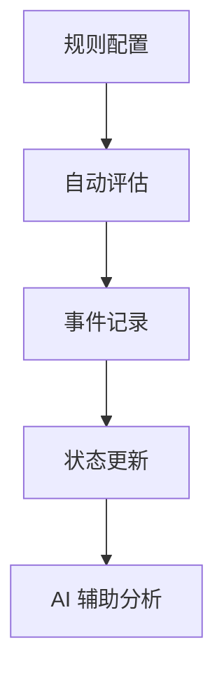
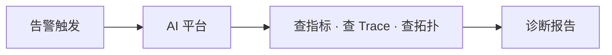

  <a href="告警.md">中文</a>
  &nbsp;|&nbsp;
  <a href="告警_en.md">English</a>

# 架构设计 · 告警

## 设计初衷

告警系统的价值不是「能响」，而是 **及时发现、清楚记录、辅助分析**。

---

## 告警基础链路

| 环节 | 解决什么问题 |
|------|-------------|
| **规则配置** | 明确服务范围、指标和触发条件 |
| **定时评估** | 按周期检查指标，发现异常 |
| **事件记录** | 记录触发、状态和恢复线索 |
| **AI 分析** | 基于指标、Trace、拓扑辅助定位原因 |

---

## 当前实现

DataBuff 当前聚焦告警规则、评估和事件记录：

| 环节 | 能力 |
|------|------|
| 规则 | 灵活的指标选择与条件配置 |
| 评估 | 定时自动执行，无需人工触发 |
| 事件 | 记录异常发生、状态变化和恢复线索 |
| 分析 | 告警触发后 AI 可直接介入诊断 |

---

## 与 AI 的协同

告警不只是终点，更是 **AI 排障的起点**：

- 告警告诉你「有问题」
- AI 告诉你「什么问题、为什么、影响多大」

这是告警与 AI 协同的关键价值 —— **从记录到诊断的一体化**。

---

## 设计原则

| 原则 | 说明 |
|------|------|
| **基于真实指标** | 告警评估读的是 APM 存储中的真实数据 |
| **先做事实记录** | 当前先保证规则评估和事件记录准确 |
| **AI Ready** | 告警数据可被 AI 专家直接查询和分析 |
