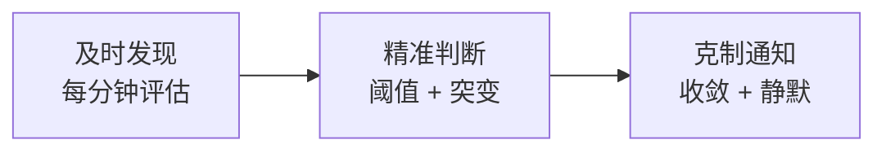
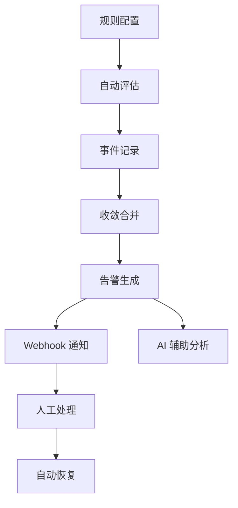
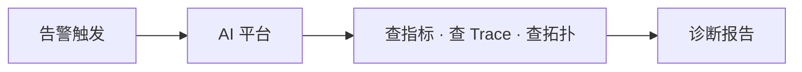

# 架构设计 · 告警

## 设计初衷

告警系统的价值不是「能响」，而是 **及时、准确、不扰民**。

---

## 告警完善的三层保障

| 层次 | 解决什么问题 |
|------|-------------|
| **及时发现** | 指标异常后 1 分钟内触发，不等问题扩散 |
| **精准判断** | 支持阈值和突变两种模式，减少误报 |
| **克制通知** | 收敛合并 + 静默计划，告别告警风暴 |

---

## 完整告警闭环

不同于「只会发通知」的简陋告警，DataBuff 提供完整闭环：

| 环节 | 能力 |
|------|------|
| 规则 | 灵活的指标选择与条件配置 |
| 评估 | 定时自动执行，无需人工触发 |
| 收敛 | 同类事件冷却期内合并，一条通知代替十条 |
| 通知 | Webhook 对接任意通知渠道 |
| 静默 | 发布/维护窗口临时压制 |
| 分析 | 告警触发后 AI 可直接介入诊断 |

---

## 与 AI 的协同

告警不只是终点，更是 **AI 排障的起点**：

- 告警告诉你「有问题」
- AI 告诉你「什么问题、为什么、影响多大」

这是告警完善性的更高层次 —— **从通知到诊断的一体化**。

---

## 设计原则

| 原则 | 说明 |
|------|------|
| **基于真实指标** | 告警评估读的是 APM 存储中的真实数据 |
| **克制而非泛滥** | 收敛机制确保运维人员不被淹没 |
| **开放对接** | Webhook 标准协议，融入现有运维体系 |
| **AI Ready** | 告警数据可被 AI 专家直接查询和分析 |
