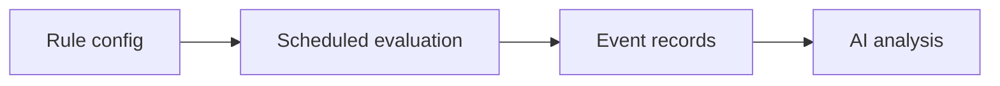
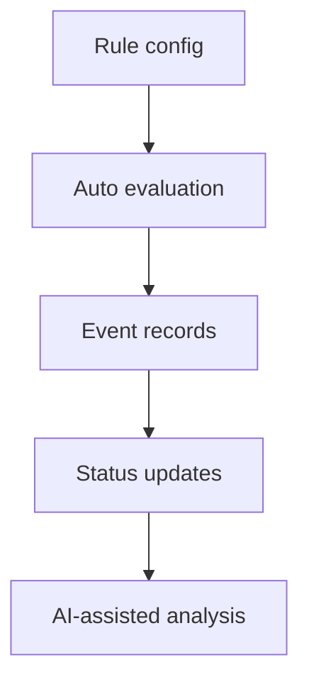
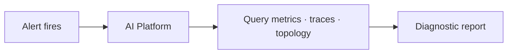

  <a href="告警.md">中文</a>
  &nbsp;|&nbsp;
  <a href="告警_en.md">English</a>

# Architecture · Alerting

## Design Intent

Alerting value is not "making noise" — it is **detect early, record clearly, and support analysis**.

---

## Alerting Pipeline

| Stage | Problem solved |
|-------|----------------|
| **Rule config** | Define service scope, metrics, and trigger conditions |
| **Scheduled evaluation** | Periodic metric checks to find anomalies |
| **Event records** | Capture trigger, status, and recovery context |
| **AI analysis** | Help locate cause using metrics, traces, and topology |

---

## Current Implementation

DataBuff currently focuses on alert rules, evaluation, and event records:

| Stage | Capability |
|-------|------------|
| Rules | Flexible metric selection and condition configuration |
| Evaluation | Scheduled automatic runs — no manual trigger |
| Events | Record occurrence, status changes, and recovery hints |
| Analysis | AI can intervene directly after alert fires |

---

## Working with AI

Alerts are not the end — they are the **starting point for AI troubleshooting**:

- Alerts tell you "something is wrong"
- AI tells you "what, why, and how big the impact is"

That is the key value of alert + AI synergy — **from record to diagnosis in one flow**.

---

## Design Principles

| Principle | Description |
|-----------|-------------|
| **Based on real metrics** | Evaluation reads real data from APM storage |
| **Facts first** | Ensure accurate rule evaluation and event records before extras |
| **AI-ready** | Alert data is directly queryable and analyzable by AI experts |
