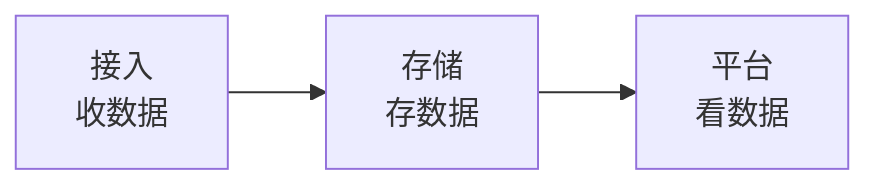
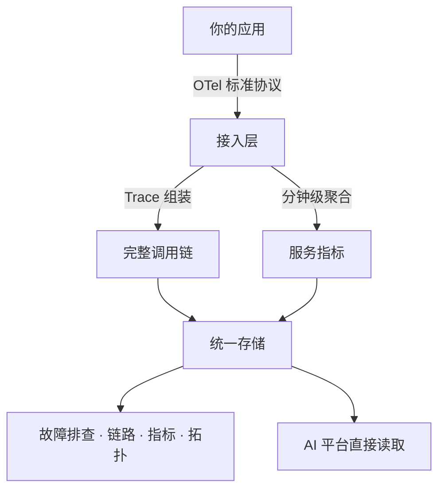
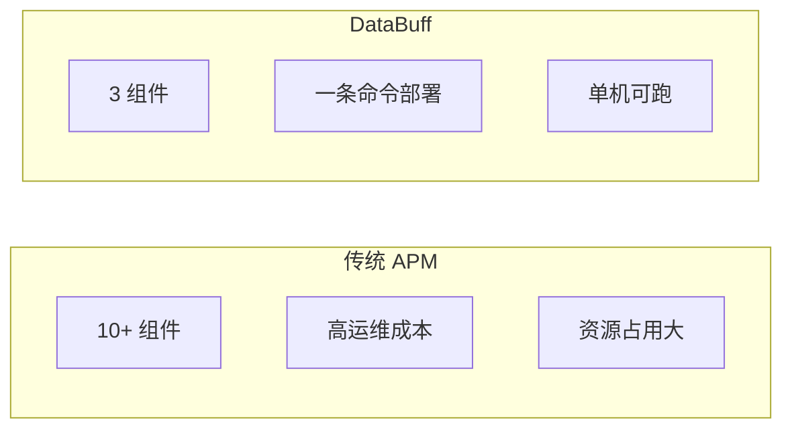
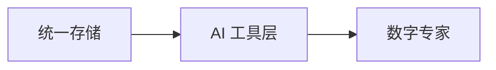

# 架构设计 · 应用性能

## 设计初衷

APM 不该是运维团队的负担 —— **极简架构、功能完善、开箱即用**。

---

## 极简三板斧

| 组件 | 职责 | 为什么这样设计 |
|------|------|---------------|
| **接入** | 接收应用上报的 Trace 和指标 | 只做数据入口，轻量高效 |
| **存储** | 统一存储所有观测数据 | 一个存储引擎搞定，不引入多种数据库 |
| **平台** | 查询、展示、告警、AI | 所有能力汇聚在一个服务 |

**对比传统 APM**：通常需要 Elasticsearch + Kafka + 多个微服务 + 复杂配置。DataBuff 用 **3 个容器** 跑完全部能力。

---

## 功能完善的数据链路

### 关键设计选择

| 设计 | 价值 |
|------|------|
| **OTel 标准接入** | 不绑定特定 Agent，生态通用 |
| **Trace 自动组装** | 分布式片段拼成完整链路，无需应用改造 |
| **指标从 Trace 派生** | 一份数据两种用途，减少采集开销 |
| **分钟级预聚合** | 查询快、存储省，告警评估高效 |

---

## 架构极简的价值

| | 传统 APM | DataBuff |
|--|----------|----------|
| 部署组件 | 10+ | **3** |
| 最低资源 | 16G+ 内存 | **8G 可跑** |
| 上手时间 | 数天 | **数分钟** |
| 运维人员 | 需专职 | **研发自运维** |

**极简不等于简陋** —— 故障排查、链路追踪、服务指标、服务拓扑、告警评估，Phase 1 全部覆盖。

---

## 与 AI 的协同关系

APM 架构极简的另一个好处：**AI 读数据的路径也极简**。

没有多数据源拼接、没有跨系统查询 —— AI 专家通过一个存储入口即可获取指标、Trace、拓扑、告警全部数据。这是 AI + APM 原生融合的工程基础。
