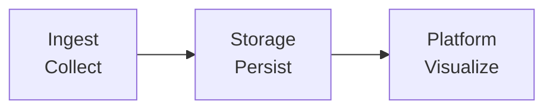
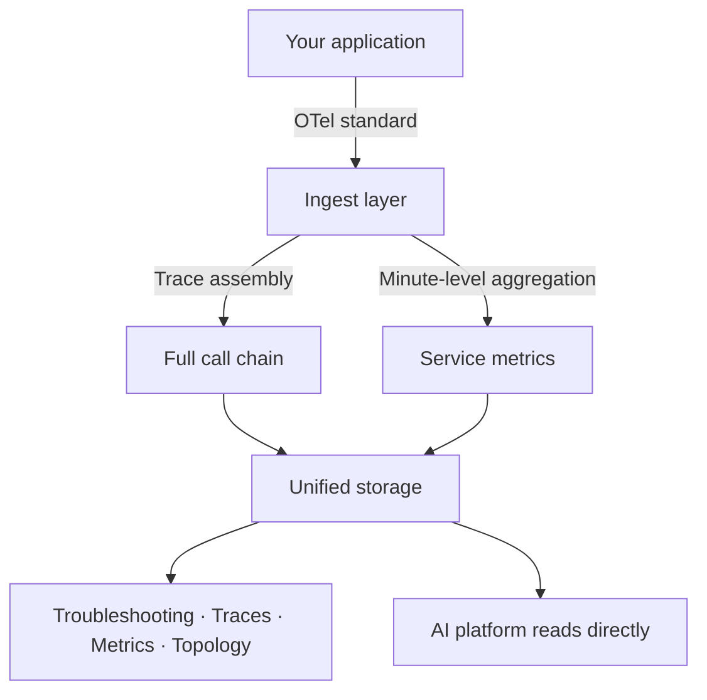
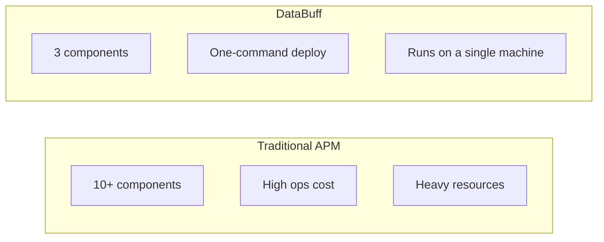
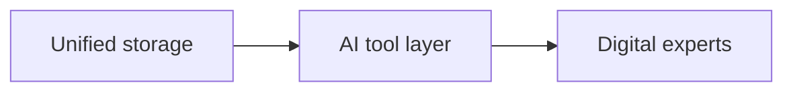

  <a href="应用性能.md">中文</a>
  &nbsp;|&nbsp;
  <a href="应用性能_en.md">English</a>

# Architecture · Application Performance

## Design Intent

APM should not be a burden for ops teams — **minimal architecture, full features, works out of the box**.

---

## Three Core Components

| Component | Responsibility | Why this design |
|-----------|----------------|-----------------|
| **Ingest** | Receive traces and metrics from applications | Data entry only — lightweight and efficient |
| **Storage** | Unified storage for all observability data | One engine — no multiple databases |
| **Platform** | Query, visualization, alerting, AI | All capabilities in one service |

**vs traditional APM**: Often Elasticsearch + Kafka + many microservices + complex config. DataBuff runs everything with **3 containers**.

---

## Full Data Pipeline

### Key Design Choices

| Design | Value |
|--------|-------|
| **OTel standard ingestion** | Not tied to a specific agent; ecosystem-friendly |
| **Automatic trace assembly** | Distributed fragments become full chains — no app changes |
| **Metrics derived from traces** | One data source, two uses — lower collection cost |
| **Minute-level pre-aggregation** | Fast queries, efficient storage, efficient alert evaluation |

---

## Value of Minimal Architecture

| | Traditional APM | DataBuff |
|--|-----------------|----------|
| Components | 10+ | **3** |
| Minimum resources | 16GB+ RAM | **8GB workable** |
| Time to value | Days | **Minutes** |
| Ops staff | Dedicated team | **Dev self-service** |

**Minimal does not mean bare-bones** — troubleshooting, tracing, service metrics, topology, and alert evaluation are all covered in Phase 1.

---

## Relationship with AI

Another benefit of minimal APM architecture: **AI's data path is minimal too**.

No multi-source stitching or cross-system queries — AI experts reach metrics, traces, topology, and alerts through one storage entry. That is the engineering foundation of AI-native OpenTelemetry APM.
